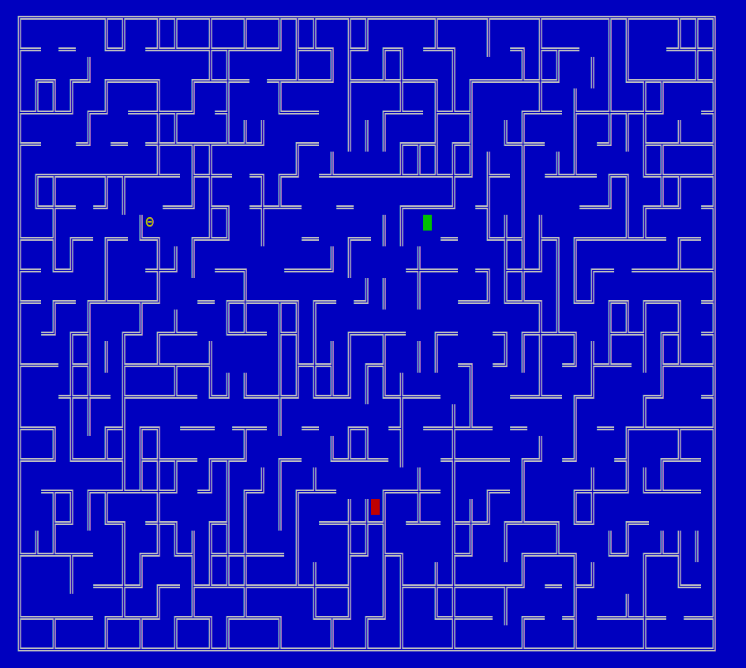

# MAPDA 

## Installation:
### Windows:
You need to install [cmake](https://cmake.org/install/) first to then build the project.

```bash
git clone git@github.com:MrrRaph/MAPDA.git
cmake 
cd ./build
cmake --build .
./MAPDA
```

### Linux:
```bash
git clone git@github.com:MrrRaph/MAPDA.git
make
```

## Usage:
In order to generate a maze 20x40:
```bash
./MAPDA -r 20 40
```

Or from a file:
```bash
./MAPDA -f filename
```

